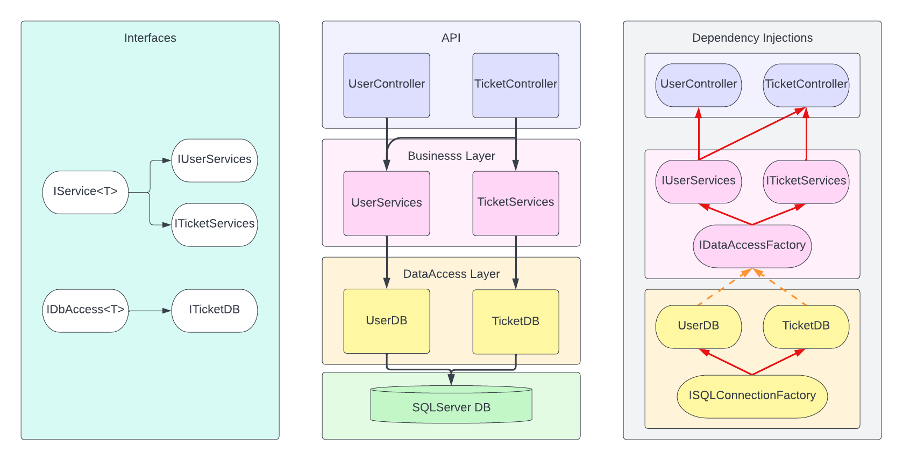

# Jacob-Allen-P1

## Overview
This is a simple application for users to submit and view expense reimbursment tickets. A remote SQL DB is used to store information on Users and Tickets. New Users can register with username and password and preivous Users can login. There are two User roles, Employees and Managers. Employees are able to submit new tickets and view their previously submitted tickets. Managers can view all submitted tickets, update the status of "Pending" tickets, and view other users. This functionality is provided in two different applications. First, a console application, which provides options for user navigation and takes input from the console. Second, a webAPI, which takes HTTP requests to GET, POST, and PUT User and Ticket information in the remote SQL DB.

## Console App
### User Stories
    - Users presented with the Main Menu
        - Login
        - Register
        - Quit
    - New Users can Register
        - Unique username
        - password
    - Returning users can Login

    - Employee role users are presented with the Employee Menu
        - Add new expense report
        - View previous expense reports
        - Logout -> Returns to Main Menu
    - Employees can add new ticket with a description and amount
    - Employess can only view their previous tickets

    - Manager role users are presented with the Manager Menu
        - Update expense reports
        - View previous expense reports
        - Print all users
        - Logout -> Return to Main Menu
    - Managers can view and update "Pending" Tickets from the list
    - Managers can view all Tickets from all users
    - Managers can view all current Users

## API
### Http Requests
- `POST api/Users/Register` - Adds new User with unique username
- `POST api/Users/login` - Logins User

- `GET api/Tickets/user/{userId}` - Returns all Tickets for User with "userId" (Employee)
- `POST api/Tickets/user/Submit` - Add a new Ticket (Employee)
- `GET api/Tickets` - Returns all Tickets (Manager)
- `GET api/Tickets/user/Pending` - Returns all "Pending" Tickets (Manager)
- `PUT api/Tickets/user/{ticketId}` - Updates the ticket status for Ticket with "ticketId" (Manager)

## Design

